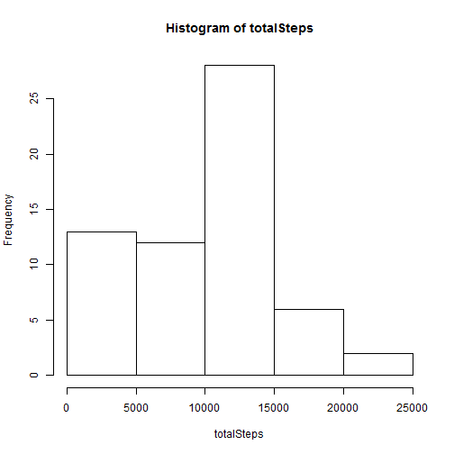
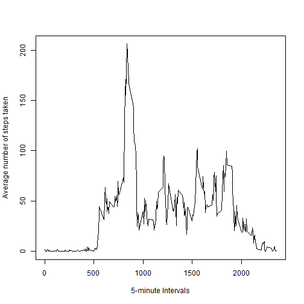
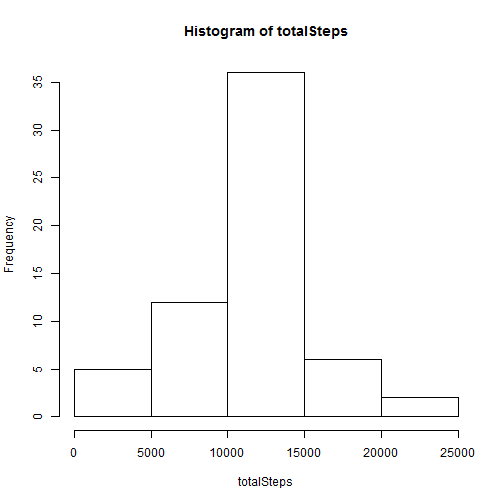
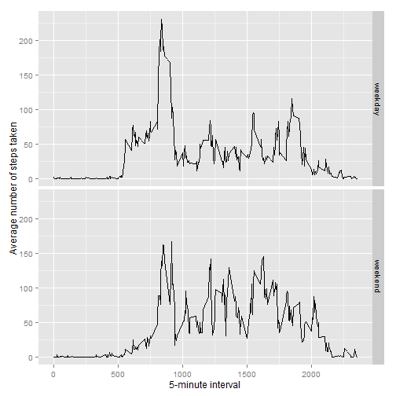

## Loading and preprocessing the data


```r
setwd("C:/Raghu/Rscipts/data")
unzip(zipfile="repdata_data_activity.zip")
activityData <- read.csv("activity.csv")
```


## What is mean total number of steps taken per day?


```r
totalSteps <- tapply(activityData$steps, activityData$date, sum, na.rm=TRUE)
hist(totalSteps)
```

 

```r
mean(totalSteps, na.rm=TRUE)
```

```
## [1] 9354.23
```

```r
median(totalSteps, na.rm=TRUE)
```

```
## [1] 10395
```


## What is the average daily activity pattern?


```r
intervalAvgs <- aggregate(x=list(steps=activityData$steps), 
                          by=list(interval=activityData$interval),
                          mean, na.rm=TRUE)

plot(intervalAvgs$interval,intervalAvgs$steps, type="l",
        xlab = "5-minute Intervals", ylab="Average number of steps taken", )
```

 

Which 5-minute interval, on average across all the days in the dataset, contains the maximum number of steps?

```r
intervalAvgs[which.max(intervalAvgs$steps),]
```

```
##     interval    steps
## 104      835 206.1698
```

## Imputing missing values

1.The total number of missing values in the dataset (i.e. the total number of rows with NAs)


```r
missing <- is.na(activityData$steps)
table(missing)
```

```
## missing
## FALSE  TRUE 
## 15264  2304
```


2.Devise a strategy for filling in all of the missing values in the dataset. The strategy does not need to be sophisticated. For example, you could use the mean/median for that day, or the mean for that 5-minute interval, etc.

Create a new dataset that is equal to the original dataset.


```r
filledActivityData <- activityData
```

All of the missing values are filled in with mean value for that 5-minute interval.


```r
# Replace each missing value with the mean value of its 5-minute interval
fillMean <- function(steps, interval) {
    filled <- NA
    if (!is.na(steps))
        filled <- c(steps)
    else
        filled <- (intervalAvgs[intervalAvgs$interval==interval, "steps"])
    return(filled)
}
filledActivityData$steps <- mapply(fillMean, filledActivityData$steps, filledActivityData$interval)
```

4.Make a histogram of the total number of steps taken each day and Calculate and report the mean and median total number of steps taken per day.


```r
totalSteps <- tapply(filledActivityData$steps, filledActivityData$date, sum, na.rm=TRUE)
hist(totalSteps)
```

 

```r
mean(totalSteps, na.rm=TRUE)
```

```
## [1] 10766.19
```

```r
median(totalSteps, na.rm=TRUE)
```

```
## [1] 10766.19
```

Please note: The new mean and median values are slightly higher than the earlier, since all NA values are replaced with mean of respective interval.

## Are there differences in activity patterns between weekdays and weekends?

1. Create a new factor variable in the dataset with two levels - 'weekday' and 'weekend' indicating whether a given date is a weekday or weekend day.


```r
dayCat <- function (stringDay){
  if (stringDay %in% c("Monday", "Tuesday", "Wednesday", "Thursday", "Friday"))
    return("weekday")
  else if (stringDay %in% c("Saturday", "Sunday"))
    return("weekend")
}
filledActivityData$wday<- sapply(weekdays(as.Date(filledActivityData$date, na.rm = TRUE)), dayCat)
class(filledActivityData$wday)
```

```
## [1] "character"
```

```r
filledActivityData$wday <- as.factor(filledActivityData$wday)
class(filledActivityData$wday)
```

```
## [1] "factor"
```

2. Make a panel plot containing a time series plot of the 5-minute interval (x-axis) and the average number of steps taken, averaged across all weekday days or weekend days (y-axis).


```r
averages <- aggregate(steps ~ interval + wday, data=filledActivityData, mean)
library(ggplot2)
```

```
## Warning: package 'ggplot2' was built under R version 3.2.1
```

```r
ggplot(averages, aes(interval, steps)) + geom_line() + facet_grid(wday ~ .) +
    xlab("5-minute interval") + ylab("Average number of steps taken")
```

 
